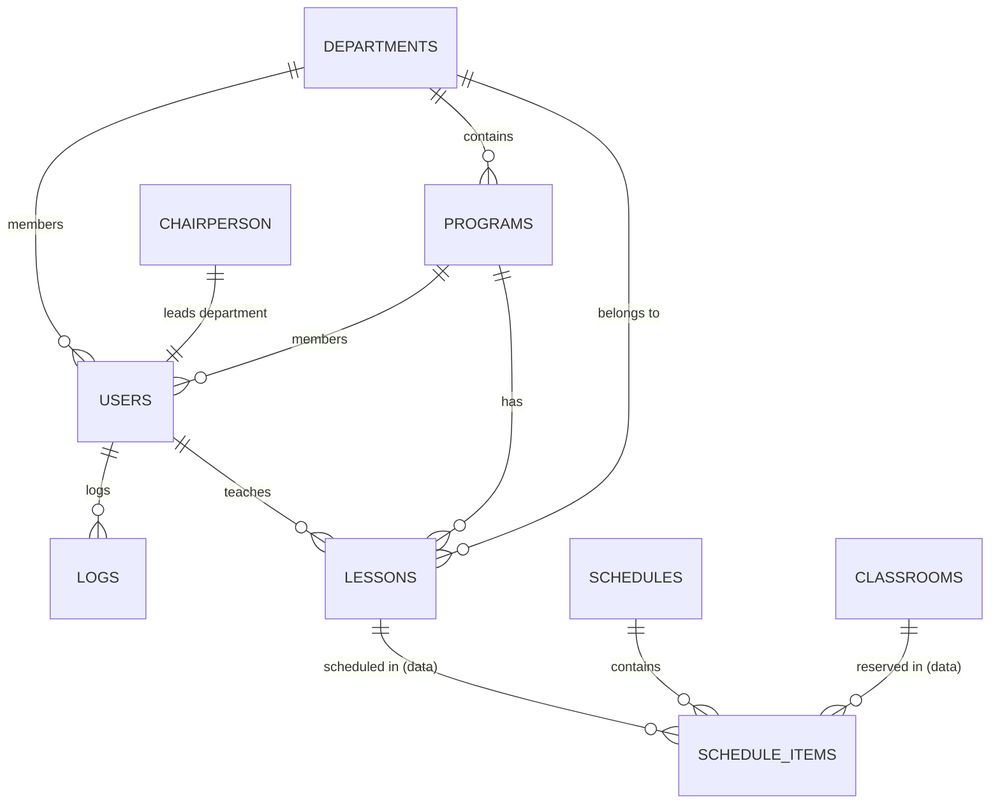

[🏠 Ana Sayfa](../../../README.md) / [App](../../README.md) / [Core](../README.md) / **Database**

---
## ER Diyagramı

## İlişki Haritası (Foreign Keys)

1.  **`schedule_items.schedule_id`** -> `schedules.id` (`ON DELETE CASCADE`)
2.  **`departments.chairperson_id`** -> `users.id`
3.  **`programs.department_id`** -> `departments.id`
4.  **`lessons.lecturer_id`** -> `users.id`

*(Tam liste ve tablo detayları için Model dokümanlarına bakınız.)*

## Metod Listesi

*   [getConnection()](./getConnection.md): Veritabanı bağlantı örneğini döndürür (Singleton).
