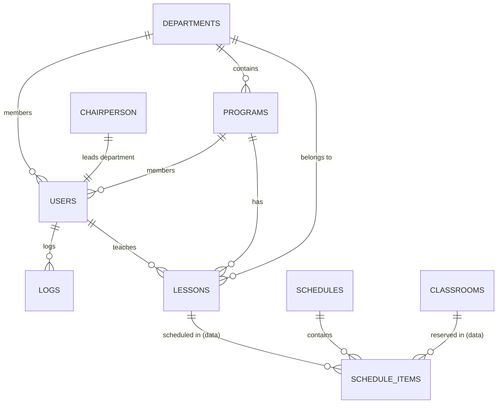

# Veritabanı Yapısı ve İlişkiler

Bu doküman, Schedule Maker projesinin veritabanı şemasını, `setup.sql` dosyasındaki tanımları ve tablolar arası ilişkileri detaylı bir şekilde açıklar.

## ER Diyagramı

## Tablo Detayları

### 1. `logs` (Sistem Günlükleri)
Uygulama genelindeki aktivitelerin ve hataların kaydedildiği tablodur.

| Sütun | Tip | Özellikler | Açıklama |
| :--- | :--- | :--- | :--- |
| `id` | INT | PK, AI | Benzersiz kayıt ID. |
| `created_at` | TIMESTAMP | DEFAULT CURRENT_TIMESTAMP | Kayıt zamanı. |
| `username` | VARCHAR(100) | NULL | İşlemi yapan kullanıcı adı. |
| `user_id` | INT | NULL, Index | İşlemi yapan kullanıcı ID. |
| `level` | VARCHAR(20) | NOT NULL, Index | Log seviyesi (info, error, debug vb.). |
| `message` | TEXT | NOT NULL | Log mesajı. |
| `class`/`method` | VARCHAR(255)| NULL | İşlemin gerçekleşti online sınıf/metod. |
| `file`/`line` | VARCHAR/INT | NULL | Hatanın oluştuğu dosya ve satır. |
| `trace` | LONGTEXT | NULL | Hata izleme (stack trace). |
| `context`/`extra` | JSON | NULL | Ekstra veriler. |

### 2. `schedules` (Ders Programı Başlıkları)
Programların genel bilgilerini ve sahipliğini tutar.

| Sütun | Tip | Özellikler | Açıklama |
| :--- | :--- | :--- | :--- |
| `id` | INT | PK, AI | |
| `type` | ENUM | NOT NULL | `lesson`, `midterm-exam`, `final-exam`, `makeup-exam` |
| `owner_type` | ENUM | NOT NULL | `user`, `lesson`, `program`, `classroom` |
| `owner_id` | INT | | Sahibin ilgili tablodaki ID'si. |
| `semester_no` | INT | | Dönem numarası (1, 2, 3...). |
| `semester` | ENUM | NOT NULL | `Güz`, `Bahar`, `Yaz` |
| `academic_year`| VARCHAR(12)| | Örn: 2023-2024 |

**Constraint**: `UNIQUE(owner_type, owner_id, semester_no, semester, academic_year, type)`

### 3. `schedule_items` (Program Blokları)
Programın içindeki her bir ders saatini temsil eder.

| Sütun | Tip | Özellikler | Açıklama |
| :--- | :--- | :--- | :--- |
| `id` | INT | PK, AI | |
| `schedule_id` | INT | FK | `schedules.id` |
| `day_index` | INT | | 0-6 arası gün indeksi. |
| `week_index` | INT | | Hafta indeksi (Sınavlar için). |
| `start_time` | TIME | | |
| `end_time` | TIME | | |
| `status` | ENUM | | `preferred`, `unavailable`, `group`, `single` |
| `data` | TEXT/JSON | | Ders, hoca, sınıf bilgileri dizisi. |
| `detail` | TEXT/JSON | | Ek detaylar (örn: `preferred=true`). |

**Constraint**: `UNIQUE(schedule_id, day_index, week_index, start_time, end_time)`, `ON DELETE CASCADE`

### 4. `users` (Kullanıcılar)
Sistem kullanıcıları ve akademisyenler.

| Sütun | Tip | Özellikler | Açıklama |
| :--- | :--- | :--- | :--- |
| `id` | INT | PK, AI | |
| `mail` | VARCHAR(90) | UNIQUE, NOT NULL | |
| `password` | TEXT | | Hashlenmiş şifre. |
| `role` | VARCHAR(20) | DEFAULT 'user' | `admin`, `manager`, `lecturer`, `user` |
| `approved` | BOOLEAN | DEFAULT false | Kullanıcı onay durumu. |
| `department_id`| INT | FK | `departments.id` |
| `program_id` | INT | FK | `programs.id` |

### 5. `departments` (Bölümler)

| Sütun | Tip | Özellikler | Açıklama |
| :--- | :--- | :--- | :--- |
| `id` | INT | PK, AI | |
| `name` | VARCHAR(100)| UNIQUE | Bölüm adı. |
| `chairperson_id`| INT | FK | Bölüm başkanı (`users.id`). |
| `active` | TINYINT(1) | DEFAULT 0 | |

### 6. `classrooms` (Derslikler)

| Sütun | Tip | Özellikler | Açıklama |
| :--- | :--- | :--- | :--- |
| `id` | INT | PK, AI | |
| `name` | VARCHAR(20) | UNIQUE | Sınıf kodu/adı. |
| `type` | VARCHAR(50) | | `uzem`, `lab`, `normal` |
| `class_size` | INT | | Ders kapasitesi. |
| `exam_size` | INT | | Sınav kapasitesi. |

### 7. `programs` (Akademik Programlar)

| Sütun | Tip | Özellikler | Açıklama |
| :--- | :--- | :--- | :--- |
| `id` | INT | PK, AI | |
| `name` | VARCHAR(100)| UNIQUE | Program adı. |
| `department_id`| INT | FK | `departments.id` |

### 8. `lessons` (Dersler)

| Sütun | Tip | Özellikler | Açıklama |
| :--- | :--- | :--- | :--- |
| `id` | INT | PK, AI | |
| `code` | VARCHAR(50) | NOT NULL | Ders kodu. |
| `hours` | INT | DEFAULT 2 | Haftalık saat sayısı. |
| `group_no` | INT | DEFAULT 0 | Birleştirme için grup no. |
| `lecturer_id` | INT | FK | `users.id` |
| `program_id` | INT | FK | `programs.id` |

**Constraint**: `UNIQUE(code, program_id, group_no)`

### 9. `settings` (Sistem Ayarları)

| Sütun | Tip | Özellikler | Açıklama |
| :--- | :--- | :--- | :--- |
| `key` | VARCHAR(255)| UNIQUE (with group) | Ayar anahtarı. |
| `value` | TEXT | | Ayar değeri. |
| `type` | ENUM | | `string`, `integer`, `boolean`, `json`, `array` |
| `group` | VARCHAR(100)| | Ayar kategorisi. |

---

## İlişki Haritası (Foreign Keys) - Eksiksiz Listesi

1.  **`schedule_items.schedule_id`** -> `schedules.id` (`ON DELETE CASCADE`)
2.  **`departments.chairperson_id`** -> `users.id` (`ON DELETE SET NULL`)
3.  **`programs.department_id`** -> `departments.id` (`ON DELETE SET NULL`)
4.  **`lessons.lecturer_id`** -> `users.id` (`ON DELETE SET NULL`)
5.  **`lessons.department_id`** -> `departments.id` (`ON DELETE SET NULL`)
6.  **`lessons.program_id`** -> `programs.id` (`ON DELETE SET NULL`)
7.  **`users.department_id`** -> `departments.id` (`ON DELETE SET NULL`)
8.  **`users.program_id`** -> `programs.id` (`ON DELETE SET NULL`)
